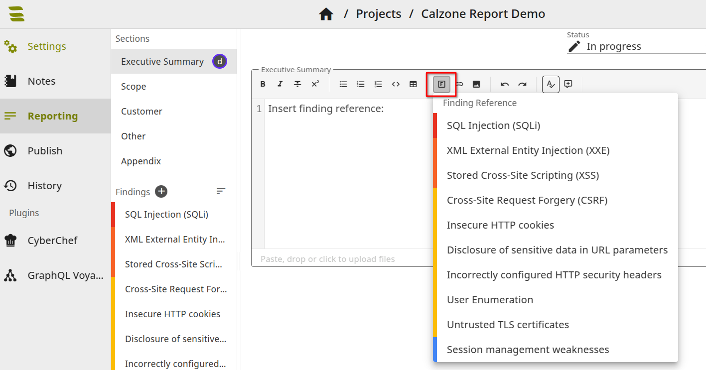

---
upcoming:
 - As you see in [the image below](#sqli) (rendered as "the image below")
 - As you see in <ref to="sqli">the image below</ref> (rendered as "the image below")
 - See [below](#00000000-0000-0000-0000-000000000000)... (rendered as "below")
 - See <ref to="#00000000-0000-0000-0000-000000000000">below</ref>... (rendered as "below")
 - Find details in <ref to="findings">the findings chapter</ref> (rendered as "the findings chapter").
 - Find details in [the findings chapter]"#findings" /> (rendered as "the findings chapter").
---

# References
Use the `id`-attributes of HTML elements for referencing items in your report.
This allows you to reference for example:

* Headings
* Figures
* Tables
* Findings
* and everything that has an `id`

## Reference Images
```md title="Markdown"
{#sqli}
As you see in [](#sqli) (e.g. rendered as "Figure 3")
```

```html title="HTML"
<figure id="sqli"><figcaption>SQL Injection</figcaption></figure>
As you see in <ref to="sqli" /> (e.g. rendered as "Figure 3")
```

## Reference Findings
You need the finding ID of the finding you want to reference. 
The markdown editor toolbar in projects provides a button to insert finding references.




```md title="Markdown"
See [](#00000000-0000-0000-0000-000000000000)... (e.g. rendered as "1.3 SQL injection")
```

```html title="HTML"
See <ref to="#00000000-0000-0000-0000-000000000000" />... (e.g. rendered as "1.3 SQL injection")
```

## Reference Headings
You can reference headings if your [design supports it](../designer/headings-and-table-of-contents.md#referencing-sections-in-text-outside-of-toc).


```md title="Markdown"
# Findings {#findings .in-toc.numbered}
Find details in [](#findings) (rendered as "1 Findings").
```

```html title="HTML"
<h1 id="findings" class="in-toc numbered">Findings</h1>
Find details in <ref to="findings" /> (rendered as "1 Findings").
```